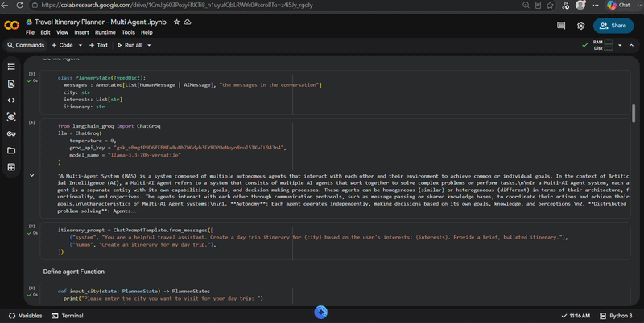

# 🌍 Multi-Agent Travel Planner with LangGraph

An AI-powered **Multi-Agent Travel Planner** built entirely in **Google Colab** using **LangGraph**, **LangChain**, **Groq LLM**, and **Gradio**.

This project demonstrates how **Agentic AI** can solve a real-world problem by coordinating multiple AI agents through a **stateful workflow**. Instead of relying on a single prompt, the application breaks travel planning into multiple stages, where each agent performs a specific task before passing its output to the next agent.

---

## 📸 Demo



---

# ✨ Features

- 🌍 Personalized travel itinerary generation
- 🤖 Multi-Agent workflow using LangGraph
- 🧠 Stateful AI workflow with StateGraph
- 💬 User interaction through Gradio
- ⚡ High-speed inference with Groq Llama 3.3 70B
- ❤️ Personalized recommendations based on user interests
- 📋 Structured itinerary generation
- 📓 Entire project developed in Google Colab

---

# 🧠 Project Workflow

The application models travel planning as a sequence of AI agents.

```
User
 │
 ▼
Enter Destination
 │
 ▼
Enter Interests
 │
 ▼
StateGraph Workflow
 │
 ├──────────────┐
 ▼              ▼
City Agent   Interest Agent
        │
        ▼
 Itinerary Agent
        │
        ▼
 Groq LLM
        │
        ▼
 Personalized Travel Plan
```

---

# 🔄 Agent Workflow

The workflow consists of three independent AI nodes.

### 🏙️ Agent 1 — City Input

Collects the destination city from the user.

Example:

```
Tokyo
```

---

### ❤️ Agent 2 — Interest Input

Collects the user's travel preferences.

Example:

```
Food
Anime
History
Shopping
```

---

### 🗺️ Agent 3 — Itinerary Generator

Uses the collected information and sends a prompt to the Groq LLM to generate a personalized day-trip itinerary.

---

# 🏗 LangGraph StateGraph

The application is built using **StateGraph**, which manages the flow of information between the agents.

```
START
  │
  ▼
input_city
  │
  ▼
input_interest
  │
  ▼
create_itinerary
  │
  ▼
 END
```

---

# 🛠 Technologies Used

### AI Frameworks

- LangGraph
- LangChain

### Large Language Model

- Groq API
- Llama 3.3 70B Versatile

### User Interface

- Gradio

### Programming Language

- Python

### Development Environment

- Google Colab

---

# 📚 Key Components

## 1. StateGraph

The core workflow engine that controls how agents communicate.

---

## 2. PlannerState

A custom state object that stores

- Conversation history
- Destination city
- User interests
- Generated itinerary

---

## 3. Node Functions

Each node performs a dedicated task.

- `input_city()`
- `input_interest()`
- `create_itinerary()`

---

## 4. LLM Integration

The Groq-hosted Llama 3.3 70B model generates personalized travel plans using prompt engineering.

---

# 📋 Example

### User Input

Destination

```
Paris
```

Interests

```
Museums
Cafes
Shopping
History
```

---

### Generated Output

```
🗓️ Day Trip Itinerary

09:00 AM
Visit the Louvre Museum

11:30 AM
Walk through the Tuileries Garden

01:00 PM
Lunch at a traditional French café

03:00 PM
Explore Champs-Élysées

06:00 PM
Visit the Eiffel Tower

08:00 PM
Dinner along the Seine River
```

---

# 🚀 Running the Project

Since the project was developed in **Google Colab**, there is no installation required.

### Step 1

Open the notebook in Google Colab.

### Step 2

Install the required libraries.

```python
!pip install langgraph
!pip install langchain
!pip install langchain_core
!pip install langchain_groq
!pip install langchain_community
!pip install gradio
```

### Step 3

Replace your Groq API key.

```python
groq_api_key="YOUR_GROQ_API_KEY"
```

### Step 4

Run all notebook cells.

### Step 5

Launch the Gradio interface.

---

# 📂 Repository Structure

```
Multi-Agent-Travel-Planner/

│
├── Multi_Agent_Travel_Planner.ipynb
│
├── screenshots/
│
├── README.md
│
└── LICENSE
```

---

# 📖 Concepts Demonstrated

- Agentic AI
- Multi-Agent Systems
- LangGraph
- StateGraph
- Stateful Workflows
- Prompt Engineering
- LLM Integration
- Workflow Orchestration
- Human-AI Interaction
- Personalized Recommendation Systems

---

# 🚀 Future Improvements

- 🌤️ Real-time Weather API
- 🏨 Hotel Recommendations
- 🍽️ Restaurant Suggestions
- ✈️ Flight Search
- 💰 Budget Planning
- 🗺️ Google Maps Integration
- 🚖 Transportation Suggestions
- 📍 Nearby Attractions
- 💬 Conversational Memory
- 📅 Multi-Day Trip Planning
- 🌍 Multi-language Support
- 📄 Export itinerary as PDF

---

# 🎯 Learning Outcomes

This project helped me understand

- LangGraph fundamentals
- StateGraph architecture
- Multi-Agent AI systems
- Prompt engineering
- Workflow orchestration
- LLM integration
- Agent communication
- Human-AI interaction
- Building AI applications in Google Colab

---

# ⚠️ Note

This project is intended for educational purposes to demonstrate **Agentic AI** and **LangGraph** workflows. It generates AI-powered travel recommendations and should not be considered professional travel advice.

---

# 🤝 Contributing

Contributions, suggestions, and improvements are welcome.

1. Fork the repository
2. Create a feature branch
3. Commit your changes
4. Push the branch
5. Open a Pull Request

---

# ⭐ Support

If you found this project helpful, consider giving it a ⭐ on GitHub.

---

# 👨‍💻 Author

**Sanaya Samadhi**

- GitHub: https://github.com/it21302862
- LinkedIn: https://www.linkedin.com/in/sanaya-samadhi/

---

# 📜 License

This project is licensed under the MIT License.